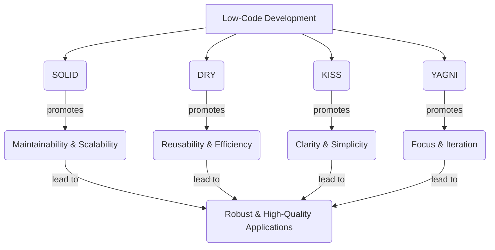

### Single Responsibility Principle (SRP)
- Definition
	- A class should have only one reason to change
	- In other words, a class should have only one job, one responsibility, one purpose.
- If a class takes more than one responsibility, it becomes coupled. 
	- This means that if one responsibility changes, other responsibilities may also be affected, leading to a ripple effect of changes throughout the codebase.

### Open Closed Principle (OCP)
- Definition: software entities (classes, modules, function, etc.) should be open for extension, but closed for modification.

#### bad design
```python
class InvoiceProcessor:
    def calculateTotal(self, region, amount):
        if region.lower() == "india":
            return amount + amount * 0.18
        elif region.lower() == "us":
            return amount + amount * 0.08
        elif region.lower() == "uk":
            return amount + amount * 0.12
        else:
            return amount  # No tax for unknown region
```
The above code is considered bad practice because:
- Adding a new region requires modifying this method
	- You risk breaking existing logic while adding new functionality
- Hard test, maintain and scale

#### good design
```python
from abc import ABC, abstractmethod

# Tax strategy Interface
class TaxCalculator(ABC):
    @abstractmethod
    def calculateTax(self, amount):
        pass

# Implementing Region-Specific Tax Calculators
class IndiaTaxCalculator(TaxCalculator):
    def calculateTax(self, amount):
        return amount * 0.18  # GST

class USTaxCalculator(TaxCalculator):
    def calculateTax(self, amount):
        return amount * 0.08  # Sales Tax

class UKTaxCalculator(TaxCalculator):
    def calculateTax(self, amount):
        return amount * 0.12  # VAT

# Invoice class
class Invoice:
    def __init__(self, amount, taxCalculator):
        self.amount = amount
        self.taxCalculator = taxCalculator

    def getTotalAmount(self):
        return self.amount + self.taxCalculator.calculateTax(self.amount)

# Example usage
amount = 1000.0

india_invoice = Invoice(amount, IndiaTaxCalculator())
print(f"Total (India): ₹{india_invoice.getTotalAmount()}")

us_invoice = Invoice(amount, USTaxCalculator())
print(f"Total (US): ${us_invoice.getTotalAmount()}")

uk_invoice = Invoice(amount, UKTaxCalculator())
print(f"Total (UK): £{uk_invoice.getTotalAmount()}")
```

### L = Liskov Substitution Principle (LSP)
- Definition: Any subclass should be substitutable for its parent class without breaking the functionality. 

```python
# Code violating LSP as it changes the behavior of setWidth and setHeight, breaking the assumptions of the parent class.

# Rectangle class
class Rectangle:
    def __init__(self):
        self.width = 0
        self.height = 0

    def setWidth(self, w):
        self.width = w

    def setHeight(self, h):
        self.height = h

    def getArea(self):
        return self.width * self.height

# Square class extending the Rectangle class
class Square(Rectangle):
    def setWidth(self, w):
        self.width = w
        self.height = w  # makes it a square

    def setHeight(self, h):
        self.height = h
        self.width = h  # makes it a square

# Method to print the area of the given rectangle object
def printArea(r):
    r.setWidth(5)
    r.setHeight(10)
    print(r.getArea())  # Expected: 50 but Actual: 100

# Main section
if __name__ == "__main__":
    # Replacing object of Rectangle class with Square class
    r = Square()

    # Method call to print the area of the rectangle
    printArea(r)
```

### I = Interface Segregation Principle (ISP)
- Don't force class to depend on methods it does not use
- e.g. In Uber app UI, don't show features created for driver to rider
```python
# we seperated functions related to driver and rider in different classes
class Rider(RiderInterface):
    def bookRide(self):  # yes
        pass

    def rateDriver(self):  # yes
        pass

class Driver(DriverInterface):
    def acceptRide(self):  # yes
        pass

    def trackEarnings(self):  # yes
        pass

    def ratePassenger(self):  # yes
        pass
```
- benefits: cleaner interface, better flexibility, high maintainability, fewer bugs, scalability


### D = Dependency Inversion Principle (DIP)
- Definition
	- High-level modules should not depend on Low-level modules. 
	- Both should depend on abstractions.
	- Abstractions should not depend on details. 
	- Details should depend on abstractions.
- Rather than High-level classes controlling and depending on the details of lower-ones, both should rely on interfaces or abstract classes.
- benefits: makes code flexible, testable and easier to maintain
```python
# BAD CODE: Recommendation engine needs RecentlyAdded to initiate
# Class implementing the recommendations based on recently added
class RecentlyAdded:
    # Method to get the recommendations
    def getRecommendations(self):
        print("Showing recently added content...")

# Class implementing the overall Recommendation Engine
class RecommendationEngine:
    def __init__(self):
        self.recommender = RecentlyAdded()

    def recommend(self):
        self.recommender.getRecommendations()

# -----------------------------------------------------------

# GOOD CODE: RecommendationEngine doesn't care how recommendations are made — it just needs a recommendation.
# The strategies (TrendingNow, RecentlyAdded, GenreBased) can be switched or upgraded anytime, without changing the engine.
from abc import ABC, abstractmethod

# Interface provided for classes to implement different recommendation strategies
class RecommendationStrategy(ABC):
    @abstractmethod
    def getRecommendations(self):
        pass

# Class implementing recommendations based on recently added
class RecentlyAdded(RecommendationStrategy):
    def getRecommendations(self):
        print("Showing recently added content...")

# Class implementing recommendations based on trending now
class TrendingNow(RecommendationStrategy):
    def getRecommendations(self):
        print("Showing trending content...")

# Class implementing recommendations based on Genre
class GenreBased(RecommendationStrategy):
    def getRecommendations(self):
        print("Showing content based on your favorite genres...")

# Class implementing the Recommendation Engine (High - level module)
class RecommendationEngine:
    def __init__(self, strategy: RecommendationStrategy):
        self.strategy = strategy

    def recommend(self):
        self.strategy.getRecommendations()

# Main driver code
if __name__ == "__main__":
    strategy = TrendingNow()  # could also be RecentlyAdded or GenreBased
    engine = RecommendationEngine(strategy)
    engine.recommend()
```