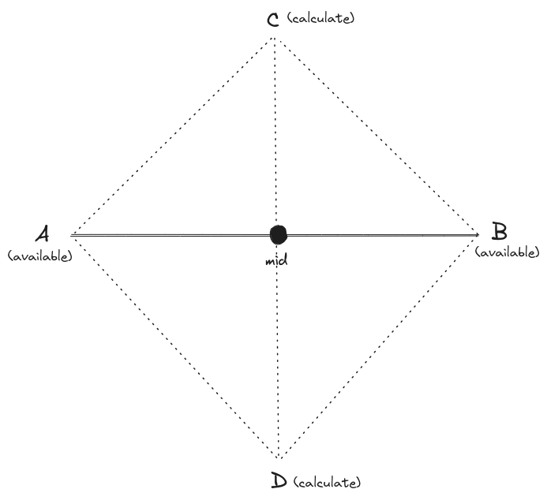

Write a function that takes in a list of Cartesian coordinates(x,y) and returns the number of squares that can be formed by these coordinates


```python
# O(n^2) time, O(n) space, where n is the number of points
def countSquares(points):
    pointsSet = set()
    for point in points:
        pointsSet.add(pointToStr(point))

    count = 0
    for pointA in points:
        for pointB in points:
            if pointA == pointB:
                # python supports list/array comparison
                continue

            midpoint = [(pointA[0] + pointB[0])/2, (pointA[1]+pointB[1])/2]
            xDistanceFromMid = pointA[0] - midpoint[0]
            yDistanceFromMid = pointA[1] - midpoint[1]

            pointC = [midpoint[0] + yDistanceFromMid, midpoint[1] - xDistanceFromMid]
            pointD = [midpoint[0] - yDistanceFromMid, midpoint[1] + xDistanceFromMid]

            if pointToStr(pointC) in pointsSet and pointToStr(pointD) in pointsSet:
                count += 1

    # we are finding potential square for every point, square have four points
        # hence we are count each square four times
    return count / 4


def pointToStr(point):
    if point[0] % 1 == 0:
        # due to division, we may get float numbers, so we are going
            # to convert non-decimal float numbers to integers for valid comparison
        point[0] = int(point[0])
    if point[1] % 1 == 0:
        point[1] = int(point[1])

    return ",".join([str(coordinate) for coordinate in point])
    
```